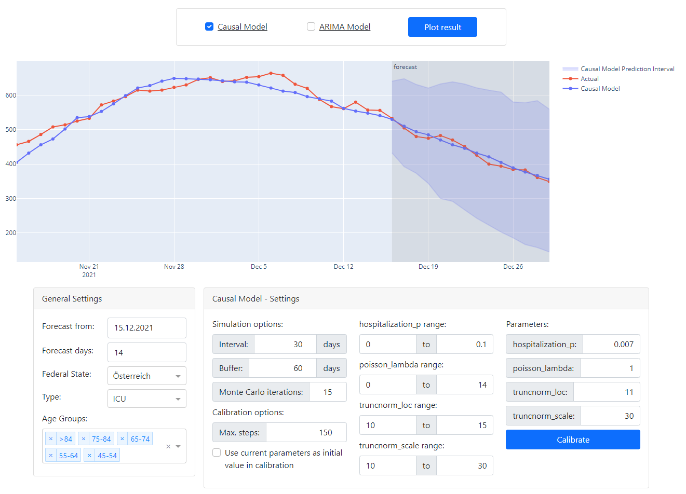

# Hospitalization model

This project was carried out as part of a lecture in my mathematics studies at [TU Wien](https://tuwien.ac.at). Hospitalization numbers depend a lot on the spread of a disease, but on the other hand, don't have a high influence on the respective case numbers. This observation motivates the approach to develop an epidemiological model to predict the case numbers first and then use those numbers in a different model to forecast the related hospitalizations. This simplifies the modeling process since all problems with verification, parametrization and validation become disentangled and are therefore easier to handle. 

The goal of this project was to develop a model to depict and forecast the COVID-19-related normal and ICU bed occupancy based on (predicted) COVID-19 case data. For this, two modeling concepts were tried out: a causal modeling approach based on the idea, that COVID-cases cause hospitalizations and occupancy = hospitalizations − releases, and a sole data-based approach using statistical concepts (which after a lot of testing resulted in a SARIMAX model). The implementation and evaluation of both models are described in the [project documentation](documentation.pdf) (in German). 

The `src` directory of this repository contains the source code of both models and the data loading scripts. The `find_interval_*` and `benchmark_*` scripts in the root directory were used to identify the ideal calibration interval length and evaluate the performance of the models (more details in the [documentation](documentation.pdf)). Those scripts outputted their results as JSON files in the `benchmark` folder, which were analyzed in the Jupyter notebooks in the `notebooks` folder. I also created a [dash](https://dash.plotly.com/) app to be able to interactively play around with the final models. This app is started by running `interactive.py`. The following image is a screenshot of that app:

## How to install
This project was developed in a [Visual Studio Code Dev Container](https://code.visualstudio.com/docs/devcontainers/containers). If you have Docker and VSCode installed, you only need to clone this repository and open it as a development container; the rest will happen automatically. 

The manual approach would be to clone this repository and install the `requirements.txt` in a new environment. Afterwards you would need to run `download_data.py`, which will download the required case and hospitalization data from [AGES](https://covid19-dashboard.ages.at/) and save it to the `data` folder.
